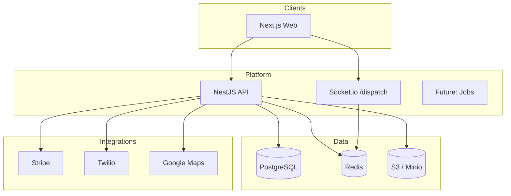

# Architecture Overview

## System context

## Layered API design

| Layer | Responsibility |
|-------|----------------|
| Controller | HTTP, auth guards, Zod validation |
| Service | Business rules, audit, realtime |
| Repository | Prisma persistence |
| Gateway | WebSocket events |

## API envelope

All REST responses use `ApiResponse<T>` from `@uk-phv/shared-types`. Global `ResponseTransformInterceptor` wraps successes; `AllExceptionsFilter` wraps errors.

## RBAC

Roles map to permissions via `ROLE_PERMISSIONS`. Guards: `JwtAuthGuard` → `PermissionsGuard`.

## Realtime

Namespace `/dispatch`. Redis caches driver locations. Events follow `DispatchEventType`.

## Compliance data flow

1. Booking created → `retentionExpiresAt` set
2. Dispatch assign → licence validation → `dispatch_logs` + audit
3. Status change → `booking_status_history` append-only
4. Complaint/safeguarding → audit + retention

## Shared packages strategy

| Package | Purpose |
|---------|---------|
| `@uk-phv/shared-types` | Enums, API types, RBAC |
| `@uk-phv/validation` | Zod schemas for API + forms |
| `@uk-phv/logger` | Pino factory |
| `@uk-phv/config-*` | Tooling configs |

## Scalability path

1. **MVP** — monolithic API, single operator
2. **Growth** — Redis adapter for Socket.io horizontal scale
3. **Scale** — read replicas, booking partition by `operatorId`, SQS job queue
